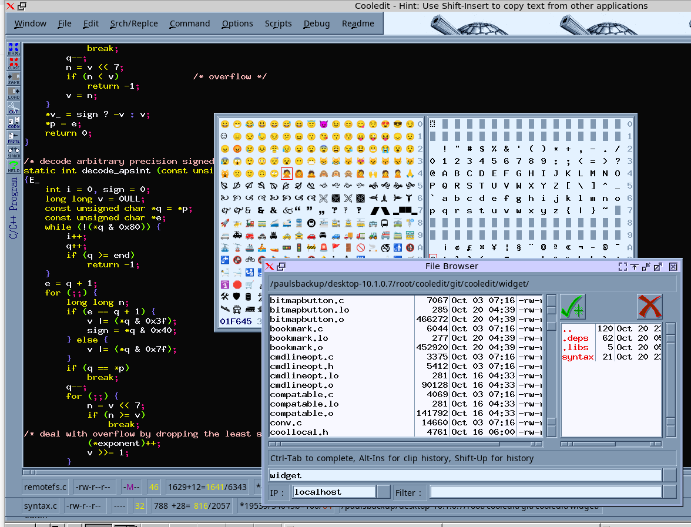
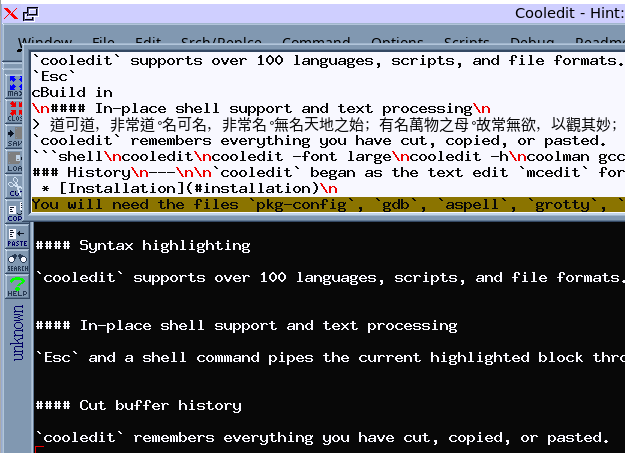
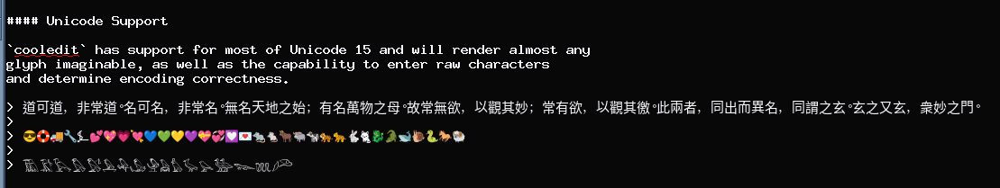

# Cooledit

`cooledit` is a modern programmer's text editor and integrated development environment with graphical debugger.



Contents
========

 * [Installation](#installation)
 * [Usage](#usage)
 * [Features](#features)
 * [History](#history)
 * [Source Map](#source-map)


### Installation
---


#### Prerequisites

`cooledit` requires the [`FreeType`](http://freetype.org/) library for fonts.
Many features do not work without the support of additional packages.
You will need the files `pkg-config`, `gdb`, `aspell`, `grotty`, `libfreetype.so.6`, and `libX11.so` to be installed on your system.
See [INSTALL.freebsd](https://github.com/paulsheer/cooledit/blob/master/INSTALL.freebsd) for required FreeBSD packages, or check for an available port.
See [INSTALL](https://github.com/paulsheer/cooledit/blob/master/INSTALL) for building the latest `FreeType` from source code and building into `/opt/cooledit`.
For Ubuntu install `libx11-dev`, `libfreetype-dev`, `gdb`, `aspell`, `aspell-en`, and `groff-base`.


#### Quick Build: Install From Source

```bash
$ ./configure
$ make
$ make install
```

### Usage
---

Here are some startup options for `cooledit`:


```shell
cooledit
cooledit -font large
cooledit -h
coolman gcc
coolman cooledit
```


### Features
---

#### Syntax highlighting

`cooledit` supports over 100 languages, scripts, and file formats.


#### In-place shell support and text processing

`Esc` and a shell command pipes the current highlighted block through the shell command. A very powerful feature.


#### Clipboard history

`cooledit` remembers everything you have cut, copied, or pasted.



#### Unicode Support

`cooledit` has support for most of Unicode 15 and will render almost any
glyph imaginable, as well as the capability to enter raw characters
and determine encoding correctness.

> 道可道，非常道。名可名，非常名。無名天地之始；有名萬物之母。故常無欲，以觀其妙；常有欲，以觀其徼。此兩者，同出而異名，同謂之玄。玄之又玄，衆妙之門。
> 
> 😎🛟🚚🔧⍼💕💖💗💘💙💚💛💜💝💞💟💌🐀🐁🐂🐃🐄🐅🐆🐇🐈🐉🐊🐋🐌🐍🐎🐏
> 
> 𓅀𓅁𓅂𓅃𓅄𓅅𓅆𓅇𓅈𓅉𓅊𓅚𓅪𓅺𓆊𓆚𓆪𓆺




### History
---

`cooledit` began as the text editor `mcedit` for the Midnight Commander
project in 1998 and was presented by me at the 1999 Atlanta Linux Showcase.


### Source Map
---

```
cooledit/
├── widget [widget library]
│   └── syntax [unit tests for syntax highlighting]
├── notosans [selected google .ttf files to cover most of unicode 15 ]
├── remotefs [remote access server]
├── man [documentation]
├── rxvt [built in shell terminal]
├── syntax [syntax highlighting rules]
└── editor [executables]
```

